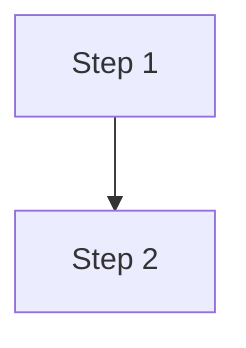

# CLAUDE.md -- Astro Blog

## What This Is

Personal technical blog built with Astro 5.16 and AstroPaper v5.5. Content covers AI experimentation, coding guides, system administration, and research notes. Deployed to GitHub Pages at https://codeshrew.github.io/ai-lab-notes/.

See `SPEC.md` for the full technical specification.

## Key Commands

```bash
# Development
pnpm dev                 # Start dev server at http://localhost:4321
pnpm build               # Production build to dist/ (includes astro check + pagefind)
pnpm preview             # Preview production build locally
pnpm check               # Run Astro type checking (also runs as part of build)

# Code quality
pnpm format              # Format with Prettier
pnpm format:check        # Check formatting
pnpm lint                # Run ESLint

# Content
pnpm sync                # Regenerate TypeScript types after schema changes
```

## Node.js Setup

This project uses Node 22 LTS. A `.node-version` file is in the repo root.

- **fnm** (Fast Node Manager) is installed at `~/.local/share/fnm`
- Run `fnm use` in the project directory to activate Node 22
- **pnpm** is the package manager (installed globally under Node 22)

## Creating a New Post

Use the `/new-post` skill or follow these steps:

1. **Create the file** at `src/data/blog/YYYY-MM-DD_slug-in-kebab-case.md`
2. **Add frontmatter** using this template:

```yaml
---
title: "Post Title Here"
author: sk
pubDatetime: 2026-02-08T00:00:00Z
featured: false
draft: true
tags:
  - tag1
  - tag2
description: "One-line summary, max 200 characters."
---
```

3. **Write content** in standard Markdown. Use fenced code blocks, Mermaid diagrams, and KaTeX math as needed.
4. **Preview** with `pnpm dev` -- navigate to `http://localhost:4321/posts/SLUG/`
5. **When approved**, set `draft: false`

### Frontmatter Fields

| Field | Required | Type | Notes |
|-------|----------|------|-------|
| `title` | Yes | string | Post title |
| `description` | Yes | string | Max 200 chars, used for SEO and social cards |
| `pubDatetime` | Yes | date | ISO 8601 format |
| `author` | No | string | Defaults to `sk` |
| `draft` | No | boolean | `true` to hide from production builds |
| `featured` | No | boolean | `true` to pin to homepage |
| `tags` | No | string[] | Lowercase, hyphenated (e.g., `local-models`) |
| `modDatetime` | No | date | Set when significantly updating a post |
| `ogImage` | No | string/image | Custom Open Graph image |
| `canonicalURL` | No | string | Canonical URL if cross-posting |
| `timezone` | No | string | IANA timezone override |

### File Naming

```
src/data/blog/YYYY-MM-DD_slug-in-kebab-case.md
```

- Date prefix for chronological filesystem ordering
- Slug becomes the URL: `/posts/YYYY-MM-DD_slug-in-kebab-case/`
- Use `.mdx` extension only when embedding Astro/React components

### Images

- Store in `src/assets/images/blog/{slug}/`
- Reference with relative path: ``
- Astro auto-optimizes (WebP conversion, responsive sizes, lazy loading)
- Prefer Mermaid for diagrams (no image file needed)

### Tags

Use lowercase, hyphenated tags. Common tags: `ai`, `llm`, `local-models`, `ollama`, `lm-studio`, `coding`, `python`, `typescript`, `linux`, `pop-os`, `gpu`, `nvidia`, `setup-guide`, `til`, `research`, `review`, `claude-code`, `docker`, `agents`.

## Technical Notes

### Content Collections

Content is defined in `src/content.config.ts` with Zod schema validation. Blog posts live in `src/data/blog/` (AstroPaper v5 convention, not `src/content/blog/`). After changing the schema, run `pnpm sync` to regenerate TypeScript types.

### Mermaid Diagrams

Rendered client-side via Mermaid JS (loaded from CDN). A custom remark plugin (`src/plugins/remark-mermaid.mjs`) converts fenced `mermaid` code blocks into `<pre class="mermaid">` elements. Theme-aware (detects dark/light mode).

Use fenced code blocks with the `mermaid` language:

````markdown

````

### KaTeX Math

Installed: `remark-math` + `rehype-katex`. KaTeX CSS loaded from CDN in the base layout.

Inline: `$E = mc^2$`
Display block: `$$\sum_{i=1}^{n} x_i$$`

### Code Blocks

Shiki handles syntax highlighting. Supported features:
- Language-specific highlighting (200+ languages)
- Line highlighting via Shiki transformers
- Code copy button (built into PostDetails layout, skips `.mermaid` blocks)
- Dark/light theme-aware
- Diff notation support

### Site Configuration

Site metadata is in `src/config.ts` (title, author, description, etc.).
Social links are in `src/constants.ts`.
Astro configuration is in `astro.config.ts` (TypeScript, not .mjs).

## Content Guidelines

Lessons learned from the initial batch of blog posts:

### Writing for a General Audience

- Write for any developer, not a specific machine. Replace "my system" with "your system", "I use" with "you can use".
- When referencing specific hardware, frame it as one example among tiers: "if you have an RTX 3090 or similar 24GB GPU" rather than "on my RTX 3090".
- Convert personal research docs into general guides. Strip wiki links, internal references, and machine-specific details.
- Include multiple options and tiers (e.g., model recommendations for 8GB, 12GB, 16GB, 24GB VRAM) rather than prescribing one setup.

### Tag Conventions

- Tags are lowercase, hyphenated strings (enforced by convention, not schema).
- Use broad category tags (`ai`, `linux`, `coding`, `security`) plus specific topic tags (`ollama`, `mcp`, `playwright`, `claude-code`).
- Always include `guide` for how-to content. Use `til` for short Today-I-Learned notes.
- Avoid overly specific tags that only one post would use.

### Frontmatter Gotchas

- The Zod schema in `src/content.config.ts` does NOT include a `type` field despite what SPEC.md planned. Do not add `type: post` or `type: guide` -- it will cause a build error.
- `pubDatetime` must be a valid ISO 8601 date. The format `2026-02-08T00:00:00Z` works reliably.
- `description` has no enforced max length in the schema but should be kept under 200 characters for OG card display.
- Set `draft: true` on all new posts. The user will review and set `draft: false` to publish.
- Shiki does not recognize `gitignore` as a language identifier. Use `bash` for `.gitignore` content blocks.

### Build Verification

- Always run `pnpm build` after writing or editing posts to catch errors before committing.
- Draft posts are excluded from production builds but still validated by `astro check`.
- The build runs `astro check` (TypeScript/schema validation), then `astro build` (static generation), then `pagefind` (search indexing).

## Code Style

- **TypeScript**: Strict mode, path alias `@/*` maps to `./src/*`
- **Formatting**: Prettier (configured in `.prettierrc.mjs`)
- **Linting**: ESLint (configured in `eslint.config.js`)
- **CSS**: Tailwind CSS v4 (utility classes, via `@tailwindcss/vite` plugin)
- **Components**: Astro components (`.astro` files)

## Safety

- **Always preview before committing.** Run `pnpm build` to catch errors.
- **Do not break the build.** The build script runs `astro check` automatically.
- **Drafts are safe.** Set `draft: true` to write freely without publishing.
- **Do not commit secrets.** No API keys or credentials in content or config files.
- **Do not modify theme internals without reason.** AstroPaper files in `src/layouts/`, `src/components/`, and `src/utils/` work well as-is. Customize via configuration first, component overrides second.

## Deployment

Deployed to GitHub Pages via GitHub Actions.

- **Live URL**: https://codeshrew.github.io/ai-lab-notes/
- **Deploy trigger**: Push to `main` or manual `workflow_dispatch`
- **Workflow**: `.github/workflows/deploy.yml`
- **Dev server**: `pnpm dev` at http://localhost:4321
- **Build command**: `pnpm build`
- **Output directory**: `dist`

## Repo Layout

```
src/
  data/
    blog/               Blog posts (Markdown)
  content.config.ts     Zod schema for content collections
  config.ts             Site metadata (title, author, etc.)
  constants.ts          Social links and share links
  assets/
    images/blog/        Post images, organized by slug
    icons/              SVG icon components
  components/           Astro components
  layouts/              Page layouts (Layout, PostDetails, AboutLayout, Main)
  pages/                Route pages (index, posts, tags, search, archives, about, etc.)
  plugins/              Custom remark plugins (remark-mermaid)
  scripts/              Client-side scripts (theme toggle)
  styles/               Global CSS (Tailwind)
  utils/                Helper functions (slugify, getSortedPosts, etc.)
public/                 Static assets (favicon, OG image, pagefind index)
.claude/skills/         Claude Code skills (new-post)
astro.config.ts         Astro configuration
tsconfig.json           TypeScript configuration
SPEC.md                 Full technical specification
CLAUDE.md               This file
```
