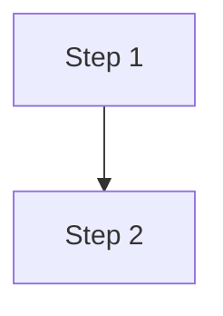

# CLAUDE.md -- Astro Blog

## What This Is

Personal technical blog built with Astro 5 and AstroPaper v5. Content covers AI experimentation, coding guides, system administration, and research notes. Deployed to Cloudflare Pages.

See `SPEC.md` for the full technical specification.

## Key Commands

```bash
# Development
pnpm dev                 # Start dev server at http://localhost:4321
pnpm build               # Production build to dist/
pnpm preview             # Preview production build locally
pnpm check               # Run Astro type checking

# Code quality
pnpm format              # Format with Prettier
pnpm format:check        # Check formatting
pnpm lint                # Run ESLint

# Content
pnpm sync                # Regenerate TypeScript types after schema changes
```

## Creating a New Post

1. **Create the file** at `src/content/blog/YYYY-MM-DD_slug-in-kebab-case.md`
2. **Add frontmatter** using this template:

```yaml
---
title: "Post Title Here"
description: "One-line summary, max 200 characters."
pubDatetime: 2026-02-08T00:00:00Z
type: post          # post | guide | note
draft: true         # Always start as draft
tags: [tag1, tag2]
---
```

3. **Write content** in standard Markdown. Use fenced code blocks, Mermaid diagrams, and KaTeX math as needed.
4. **Preview** with `pnpm dev` -- navigate to `http://localhost:4321/posts/slug/`
5. **When approved**, set `draft: false`
6. **Commit and push**: the site auto-deploys via Cloudflare Pages

### Frontmatter Fields

| Field | Required | Type | Notes |
|-------|----------|------|-------|
| `title` | Yes | string | Max 100 chars |
| `description` | Yes | string | Max 200 chars, used for SEO and social cards |
| `pubDatetime` | Yes | date | ISO 8601 format |
| `type` | No | enum | `post` (default), `guide`, `note` |
| `draft` | No | boolean | `true` to hide from production |
| `featured` | No | boolean | `true` to pin to homepage |
| `tags` | No | string[] | Lowercase, hyphenated (e.g., `local-models`) |
| `modDatetime` | No | date | Set when significantly updating a post |
| `series.name` | No | string | Series title for multi-part posts |
| `series.part` | No | number | Part number (1, 2, 3...) |
| `ogImage` | No | string | Custom Open Graph image path |
| `canonicalURL` | No | string | Canonical URL if cross-posting |

### File Naming

```
src/content/blog/YYYY-MM-DD_slug-in-kebab-case.md
```

- Date prefix for chronological filesystem ordering
- Slug becomes the URL: `/posts/slug-in-kebab-case/`
- Use `.mdx` extension only when embedding Astro/React components

### Images

- Store in `src/assets/images/blog/{slug}/`
- Reference with relative path: ``
- Astro auto-optimizes (WebP conversion, responsive sizes, lazy loading)
- Prefer Mermaid for diagrams (no image file needed)

### Tags

Use lowercase, hyphenated tags. Common tags: `ai`, `llm`, `local-models`, `ollama`, `lm-studio`, `coding`, `python`, `typescript`, `linux`, `pop-os`, `gpu`, `nvidia`, `setup-guide`, `til`, `research`, `review`, `claude-code`, `docker`, `agents`.

## Technical Notes

### Content Collections

Content is defined in `src/content.config.ts` with Zod schema validation. After changing the schema, run `pnpm sync` to regenerate TypeScript types.

All content lives in `src/content/blog/` regardless of type (post, guide, note). The `type` frontmatter field distinguishes them.

### Mermaid Diagrams

Use fenced code blocks with the `mermaid` language:

````markdown

````

### KaTeX Math

Inline: `$E = mc^2$`
Display block: `$$\sum_{i=1}^{n} x_i$$`

### Code Blocks

Shiki handles syntax highlighting. Supported features:
- Language-specific highlighting (200+ languages)
- Line highlighting: ` ```python {1,3-5} `
- Code copy button (built in)
- Dark/light theme-aware

### Series Posts

For multi-part content, add `series` to frontmatter:

```yaml
series:
  name: "Series Name"
  part: 1
```

## Code Style

- **TypeScript**: Strict mode, path aliases (`@/components`, `@/utils`, etc.)
- **Formatting**: Prettier (configured in `.prettierrc`)
- **Linting**: ESLint (configured in `.eslintrc.cjs`)
- **CSS**: Tailwind CSS v4 (utility classes)
- **Components**: Astro components (`.astro` files), React only if needed for interactivity

## Safety

- **Always preview before pushing.** Run `pnpm build` to catch errors before deploy.
- **Do not break the build.** Run `pnpm check` if unsure about TypeScript errors.
- **Drafts are safe.** Set `draft: true` to write freely without publishing.
- **Do not commit secrets.** No API keys or credentials in content or config files.
- **Do not modify theme internals without reason.** AstroPaper files in `src/layouts/`, `src/components/`, and `src/utils/` work well as-is. Customize via configuration first, component overrides second.

## Deployment

- **Primary**: Cloudflare Pages (auto-deploys on push to `main`)
- **Preview**: Every PR gets a preview URL from Cloudflare
- **Build command**: `pnpm build`
- **Output directory**: `dist`

## Repo Layout

```
src/
  content/
    blog/               Posts, guides, and notes (Markdown/MDX)
    content.config.ts   Zod schema for content collections
  assets/
    images/blog/        Post images, organized by slug
  components/           Astro components
  layouts/              Page layouts
  pages/                Route pages (index, posts, tags, search, etc.)
  plugins/              Custom remark/rehype plugins
  styles/               Global CSS
  utils/                Helper functions
public/                 Static assets (favicon, robots.txt)
.claude/skills/         Claude Code skills
SPEC.md                 Full technical specification
CLAUDE.md               This file
```
