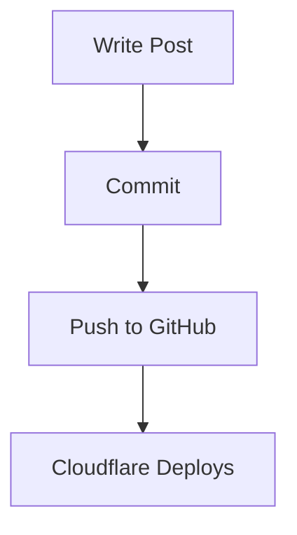

# Blog Specification

> Written February 2026. Defines the architecture, tech stack, content model, and deployment plan for a personal technical blog built with Astro.

---

## 1. Project Overview

A personal technical blog for publishing AI experimentation notes, coding guides, system administration write-ups, and research findings. The primary authoring tool is Claude Code -- the blog is designed for AI-agent-friendly content creation where posts are flat Markdown/MDX files with type-safe frontmatter.

**Goals:**

- Fast, static-first site with zero client-side JavaScript by default
- Clean, dark-mode-first design optimized for reading code-heavy technical content
- Type-safe content model with build-time validation (catch errors before deploy)
- One-command publish workflow: write Markdown, commit, push, auto-deploy
- Mermaid diagrams and KaTeX math rendering for technical posts
- Search, RSS, sitemap, and SEO out of the box

**Non-goals:**

- CMS or admin panel (posts are files in git)
- Comments system (may add later via Giscus if needed)
- Analytics (may add Cloudflare Web Analytics later -- it is privacy-respecting and free)
- Multi-language support

---

## 2. Tech Stack

### 2.1 Framework: Astro 5.x

**Current stable version:** Astro 5.17.x (as of February 2026).

Astro 6 is in beta (beta.9 as of Feb 5 2026) and requires Node 22+. It brings a redesigned dev server, first-class Cloudflare Workers support, and Zod 4. We will start on Astro 5.x (stable, mature, well-documented) and upgrade to 6.x after its stable release.

**Why Astro over Hugo (the previous recommendation):**

- **Content Collections with Zod schemas**: Type-safe frontmatter validation at build time. Hugo has no equivalent -- frontmatter errors are silent until rendering.
- **MDX support**: Embed interactive components (tabs, collapsible sections, live code) directly in Markdown. Hugo shortcodes are more limited.
- **Component islands**: Zero JS by default, but opt into interactivity per-component. Best of both worlds.
- **Modern tooling**: TypeScript-first, npm ecosystem, hot module reload, familiar to JS/TS developers.
- **Cloudflare alignment**: Cloudflare acquired The Astro Technology Company in January 2026. Astro is now a Cloudflare project with first-class deployment support. This is the strongest long-term bet for Cloudflare Pages hosting.
- **Content Layer API (Astro 5.0+)**: New loader system (glob, file, custom) for content with 5x faster builds and 50% less memory than the legacy approach.

**Tradeoffs vs Hugo:**

- Slower builds (seconds vs milliseconds per page) -- acceptable for a blog with < 1000 posts
- Node.js dependency and `node_modules` -- more disk usage, but the system already has Node 23.11
- Steeper initial setup -- mitigated by using an established theme as the starting point

**Key Astro 5 features we will use:**

- Content Layer API with `glob()` loader
- `astro:env` module for type-safe environment variables
- Merged static/hybrid rendering (static by default, opt-in SSR per route)
- Built-in Shiki syntax highlighting
- Built-in image optimization (`astro:assets`)
- View transitions (optional, for smooth page navigation)

### 2.2 Theme: AstroPaper v5

**Recommendation: AstroPaper v5.0.1** ([github.com/satnaing/astro-paper](https://github.com/satnaing/astro-paper))

AstroPaper is the most popular Astro blog theme with 4,200+ GitHub stars. Version 5 was released for Astro 5 compatibility and includes significant improvements.

**Why AstroPaper:**

| Criterion | AstroPaper v5 | Astro Nano/Micro | Starlight | Geeky |
|-----------|--------------|-----------------|-----------|-------|
| **Purpose** | Blog-first | Minimal blog | Documentation | Developer blog |
| **Dark mode** | Yes (light/dark/auto) | Yes | Yes | Yes |
| **Search** | Pagefind (full-text) | Pagefind | Algolia/Pagefind | Fuse.js |
| **Code highlighting** | Shiki | Shiki | Shiki | Shiki |
| **ToC** | Yes | No | Yes (sidebar) | Yes |
| **Reading time** | Yes | No | No | Yes |
| **RSS** | Yes | Yes | No | Yes |
| **OG images** | Auto-generated | No | No | Manual |
| **TypeScript** | Full | Partial | Full | Full |
| **Tailwind** | v4 | v3 | No | v3 |
| **Accessibility** | WCAG-compliant | Basic | Excellent | Good |
| **Stars** | 4,200+ | 500+ | 5,000+ | 800+ |
| **Maintenance** | Active (2026) | Active | Active | Moderate |

**AstroPaper v5 features:**

- Astro 5 with Content Layer API
- Tailwind CSS v4 (utility-first, dark mode via CSS)
- Pagefind for full-text static search (replaced React + Fuse.js from v4)
- SVG component system (cleaner than inline SVGs)
- pnpm as package manager
- Automatic OG image generation via Satori
- Draft post support
- Tag-based taxonomy with tag pages
- Responsive design (mobile-first)
- Code copy buttons via Shiki transformer
- Sitemap and RSS built in
- WCAG 2.0 Level AA accessible

**What we will customize on top of AstroPaper:**

- Add Mermaid diagram support (remark plugin or client-side JS)
- Add KaTeX math rendering (remark-math + rehype-katex)
- Add series/multi-part post support (custom frontmatter field + component)
- Add "guides" and "notes" content types alongside blog posts
- Customize color scheme to personal preference
- Add reading progress bar (optional)

### 2.3 Supporting Libraries

| Library | Purpose | Integration |
|---------|---------|-------------|
| **Tailwind CSS v4** | Styling | Included with AstroPaper v5 |
| **Shiki** | Code syntax highlighting | Built into Astro |
| **Pagefind** | Static full-text search | Included with AstroPaper v5 |
| **remark-math** | Parse math delimiters in Markdown | Astro remark plugin |
| **rehype-katex** | Render KaTeX math to HTML | Astro rehype plugin |
| **remark-mermaid** or client-side Mermaid JS | Render Mermaid diagrams | Remark plugin or `<script>` tag |
| **@astrojs/mdx** | MDX support for interactive content | Astro integration |
| **@astrojs/sitemap** | Generate sitemap.xml | Astro integration |
| **@astrojs/rss** | Generate RSS feed | Astro library |
| **astro-icon** | Icon components (optional) | Astro integration |

### 2.4 Node.js and Package Manager

- **Node.js**: v23.11.0 (already installed on the system). Astro 5 requires Node 18.17+.
- **Package manager**: pnpm (AstroPaper v5 default). Install globally if not present: `npm install -g pnpm`.

---

## 3. Content Architecture

### 3.1 Content Types

The blog has three content types, all stored as Markdown/MDX files in `src/content/`:

| Type | Directory | Description | URL Pattern |
|------|-----------|-------------|-------------|
| **Blog posts** | `src/content/blog/` | Standard blog posts, essays, project write-ups | `/posts/{slug}/` |
| **Guides** | `src/content/blog/` | Long-form tutorials and how-to articles | `/posts/{slug}/` |
| **Notes** | `src/content/blog/` | Short TIL (Today I Learned) entries, quick tips | `/posts/{slug}/` |

All three types live in the same `blog` collection but are distinguished by a `type` field in frontmatter. This keeps the URL structure simple and lets all content appear in a unified feed, while still being filterable.

### 3.2 Frontmatter Schema

Defined in `src/content.config.ts` using Zod:

```typescript
import { defineCollection, z } from "astro:content";
import { glob } from "astro/loaders";

const blog = defineCollection({
  loader: glob({ pattern: "**/*.{md,mdx}", base: "./src/content/blog" }),
  schema: z.object({
    // Required fields
    title: z.string().max(100),
    description: z.string().max(200),
    pubDatetime: z.coerce.date(),

    // Optional fields
    modDatetime: z.coerce.date().optional().nullable(),
    author: z.string().default("sk"),
    type: z.enum(["post", "guide", "note"]).default("post"),
    draft: z.boolean().default(false),
    featured: z.boolean().default(false),
    tags: z.array(z.string()).default([]),

    // Series support (for multi-part posts)
    series: z
      .object({
        name: z.string(),
        part: z.number().int().positive(),
      })
      .optional(),

    // SEO overrides (optional -- defaults derived from title/description)
    ogImage: z.string().optional(),
    canonicalURL: z.string().url().optional(),
  }),
});

export const collections = { blog };
```

### 3.3 Example Frontmatter

**Blog post:**

```yaml
---
title: "Building an AI Workstation on Pop!_OS with an RTX 3090"
description: "Complete setup guide for CUDA, Ollama, LM Studio, and local LLM inference on Pop!_OS 24.04."
pubDatetime: 2026-02-08
type: post
tags: [ai, linux, gpu, setup-guide]
featured: true
---
```

**Guide (multi-part):**

```yaml
---
title: "Local AI Coding Agents, Part 1: Architecture"
description: "How to set up OpenCode with local models for AI-assisted development."
pubDatetime: 2026-02-10
type: guide
tags: [ai, coding, agents, opencode]
series:
  name: "Local AI Coding Agents"
  part: 1
---
```

**Quick note/TIL:**

```yaml
---
title: "TIL: Ollama Model Storage Location"
description: "Where Ollama stores models and how to change it."
pubDatetime: 2026-02-08
type: note
tags: [ollama, til]
---
```

### 3.4 File Naming Convention

```
src/content/blog/YYYY-MM-DD_slug-in-kebab-case.md
src/content/blog/YYYY-MM-DD_slug-in-kebab-case.mdx  (if using components)
```

Examples:

```
src/content/blog/2026-02-08_ai-workstation-setup.md
src/content/blog/2026-02-10_local-coding-agents-part-1.md
src/content/blog/2026-02-10_local-coding-agents-part-2.md
src/content/blog/2026-02-08_til-ollama-storage.md
```

The date prefix ensures chronological ordering in the filesystem and makes it easy for AI agents to generate unique filenames. The slug becomes the URL path.

### 3.5 Tag Taxonomy

Tags are lowercase, hyphenated strings. Recommended initial tags:

| Category | Tags |
|----------|------|
| **AI/ML** | `ai`, `llm`, `local-models`, `ollama`, `lm-studio`, `rag`, `fine-tuning`, `agents` |
| **Coding** | `coding`, `python`, `typescript`, `rust`, `cli` |
| **Tools** | `claude-code`, `opencode`, `comfyui`, `docker` |
| **System** | `linux`, `pop-os`, `gpu`, `nvidia`, `setup-guide` |
| **Meta** | `til`, `research`, `review` |

### 3.6 Draft Handling

- Set `draft: true` in frontmatter to exclude a post from production builds
- `npm run dev` shows drafts by default (AstroPaper behavior)
- `npm run build` excludes drafts
- Drafts are committed to git but not deployed

### 3.7 Image Handling

Images are stored alongside content or in a shared assets directory:

```
src/content/blog/2026-02-08_ai-workstation-setup.md
src/assets/images/blog/ai-workstation-setup/
  architecture.png
  benchmark-results.svg
  gpu-utilization.png
```

Reference in Markdown:

```markdown

```

Astro's built-in image optimization (`astro:assets`) will:

- Convert to WebP/AVIF automatically
- Generate responsive `srcset` for different viewport sizes
- Lazy-load below-the-fold images
- Provide width/height attributes to prevent layout shift

For simple screenshots or diagrams, standard Markdown image syntax works. For advanced layouts, use the `<Image>` component in MDX files.

---

## 4. Features

### 4.1 Search

**Implementation: Pagefind** (included with AstroPaper v5)

Pagefind is a static search library that indexes the built HTML at build time and serves a lightweight client-side search UI. No server, no external service, no API keys.

- Indexes all post content, not just titles and descriptions
- Search UI appears on the `/search/` page
- Keyboard shortcut (Ctrl+K) to open search
- Tiny bundle size (~50KB total)

No additional configuration needed -- AstroPaper v5 includes Pagefind out of the box.

### 4.2 RSS Feed

AstroPaper generates an RSS feed at `/rss.xml` using `@astrojs/rss`. The feed includes:

- All published (non-draft) posts
- Title, description, publication date, and full content
- Proper XML formatting for feed readers

### 4.3 Sitemap

Generated automatically by `@astrojs/sitemap` at `/sitemap-index.xml`. Includes all published pages and posts.

### 4.4 SEO

AstroPaper provides:

- Open Graph meta tags (title, description, image, type)
- Twitter Card meta tags
- Canonical URL support
- Automatic OG image generation via Satori (creates social preview images from post titles)
- Structured data (JSON-LD) for blog posts
- Proper `<meta>` description tags

### 4.5 Dark/Light Mode

AstroPaper supports three modes:

- **Light**: Clean white background
- **Dark**: Dark background (default)
- **Auto**: Follows system preference

Toggle is in the site header. Preference is stored in `localStorage`.

### 4.6 Code Highlighting

**Shiki** (built into Astro) provides:

- Syntax highlighting for 200+ languages
- Dark/light theme-aware colors
- Line numbers (configurable)
- Line highlighting (`{1,3-5}` notation)
- Code copy button (via Shiki transformer, included in AstroPaper)
- Diff highlighting (show added/removed lines)

Configuration in `astro.config.mjs`:

```javascript
export default defineConfig({
  markdown: {
    shikiConfig: {
      themes: {
        light: "github-light",
        dark: "github-dark",
      },
      wrap: true,
    },
  },
});
```

### 4.7 Mermaid Diagrams

**Implementation: Client-side rendering via Mermaid JS**

Add a Mermaid initialization script and a remark plugin that converts fenced `mermaid` code blocks into `<div class="mermaid">` elements.

Usage in Markdown:

````markdown

````

Implementation approach:

1. Create a remark plugin (`src/plugins/remark-mermaid.mjs`) that transforms `mermaid` code blocks
2. Add Mermaid JS via CDN in the base layout's `<head>` (lazy-loaded, only when a page contains `.mermaid` elements)
3. Theme-aware: detect dark/light mode and set Mermaid theme accordingly

### 4.8 KaTeX Math

**Implementation: remark-math + rehype-katex**

Install: `pnpm add remark-math rehype-katex`

Configure in `astro.config.mjs`:

```javascript
import remarkMath from "remark-math";
import rehypeKatex from "rehype-katex";

export default defineConfig({
  markdown: {
    remarkPlugins: [remarkMath],
    rehypePlugins: [rehypeKatex],
  },
});
```

Add KaTeX CSS to the base layout:

```html
<link
  rel="stylesheet"
  href="https://cdn.jsdelivr.net/npm/katex@0.16/dist/katex.min.css"
/>
```

Usage in Markdown:

```markdown
Inline math: $E = mc^2$

Display math:
$$
\sum_{i=1}^{n} x_i = x_1 + x_2 + \cdots + x_n
$$
```

### 4.9 Table of Contents

AstroPaper generates a table of contents from Markdown headings (h2-h4) for each post. It appears at the top of the post and is collapsible.

### 4.10 Reading Time

Automatically calculated from word count and displayed in the post header. AstroPaper includes this by default.

### 4.11 Responsive Images

Astro's `<Image>` component (from `astro:assets`) handles:

- Automatic format conversion (WebP, AVIF)
- Responsive `srcset` generation
- Lazy loading
- Width/height for CLS prevention

For standard Markdown images, Astro processes them through its image pipeline automatically.

---

## 5. AI Authoring Workflow

### 5.1 Creating a New Post

Claude Code creates posts by writing a Markdown file with the correct frontmatter:

```bash
# 1. Create the file
# Claude writes to: src/content/blog/YYYY-MM-DD_slug.md

# 2. Preview locally
pnpm dev
# Site available at http://localhost:4321

# 3. Review in browser
# Navigate to http://localhost:4321/posts/slug/

# 4. Iterate: Claude edits the file, Astro hot-reloads

# 5. When ready, remove draft: true (or set to false)

# 6. Commit and push
git add src/content/blog/YYYY-MM-DD_slug.md
git commit -m "Add post: Post Title Here"
git push origin main
# Cloudflare Pages auto-deploys on push to main
```

### 5.2 Post Template

Claude Code should use this template when creating new posts:

```markdown
---
title: "TITLE"
description: "DESCRIPTION (max 200 chars)"
pubDatetime: YYYY-MM-DDT00:00:00Z
type: post
draft: true
tags: [tag1, tag2]
---

Introduction paragraph.

## First Section

Content here.

## Second Section

More content.

## Conclusion

Wrap-up.
```

### 5.3 Converting Existing Docs to Posts

The `popos-managment` repo has research documents that can be converted to blog posts:

| Source Doc | Potential Post | Conversion Notes |
|-----------|---------------|-----------------|
| `docs/AGENTIC-WORKFLOWS.md` | "My AI Coding Tool Stack in 2026" | Add narrative intro, personal experience |
| `docs/AI-SOFTWARE-RECOMMENDATIONS.md` | Series: "RTX 3090 AI Workstation" | Split into 3-4 posts by category |
| `docs/OPENCODE-LOCAL-SETUP.md` | "Running Local Coding Agents with OpenCode" | Nearly ready, add frontmatter |
| `docs/AI-MODELS.md` | "Curating a Local LLM Collection" | Add rationale, benchmarks |
| `docs/BLOG-SYSTEM.md` | "Choosing a Static Site Generator in 2026" | Meta post about this very decision |
| `docs/BROWSER-AUTOMATION.md` | "Browser Automation with Playwright MCP" | Add examples |
| `docs/VOICE-INTERFACE.md` | "Adding Voice to Your Terminal" | Add personal use cases |

**Conversion process:**

1. Read the source document
2. Create a new file in `src/content/blog/` with proper frontmatter
3. Add a conversational introduction (who is this for, why it matters)
4. Adapt the reference-style content into tutorial/narrative style
5. Convert any wiki links (`[[...]]`) to standard Markdown links
6. Add a conclusion with next steps or related posts
7. Set `draft: true` for review

### 5.4 Image Workflow

When a post needs images:

1. Create the image directory: `src/assets/images/blog/{slug}/`
2. Place images there (PNG, JPG, SVG)
3. Reference with relative path from the Markdown file
4. Astro handles optimization at build time

For screenshots, use the system's screenshot tool and save directly to the image directory.

For diagrams, prefer Mermaid in Markdown (renders at view time, no image file needed). For complex diagrams that Mermaid cannot handle, export as SVG.

---

## 6. Deployment

### 6.1 Primary: Cloudflare Pages

Cloudflare Pages is the recommended deployment target. With Cloudflare's acquisition of The Astro Technology Company in January 2026, Astro has first-class Cloudflare support.

**Setup:**

1. Push the repo to GitHub
2. In Cloudflare dashboard: Workers & Pages > Create application > Pages > Connect to Git
3. Select the GitHub repository
4. Configure build settings:
   - **Framework preset**: Astro
   - **Build command**: `pnpm build`
   - **Build output directory**: `dist`
   - **Node.js version**: 22 (set via environment variable `NODE_VERSION=22`)
5. Deploy

**Features:**

- Automatic deploys on push to `main`
- Preview deploys on pull requests (each PR gets a unique URL)
- Unlimited bandwidth (free tier)
- 500 builds/month (free tier)
- Global CDN (Cloudflare's edge network)
- Custom domain + free SSL
- Web Analytics (optional, privacy-respecting)

**Environment variables for Cloudflare Pages:**

```
NODE_VERSION=22
```

No other environment variables are needed for a static site.

### 6.2 Alternative: GitHub Actions + GitHub Pages

If Cloudflare Pages is not desired, deploy via GitHub Actions:

Create `.github/workflows/deploy.yml`:

```yaml
name: Deploy Astro site to GitHub Pages

on:
  push:
    branches: [main]
  workflow_dispatch:

permissions:
  contents: read
  pages: write
  id-token: write

concurrency:
  group: "pages"
  cancel-in-progress: false

jobs:
  build:
    runs-on: ubuntu-latest
    steps:
      - name: Checkout
        uses: actions/checkout@v4

      - name: Setup pnpm
        uses: pnpm/action-setup@v4
        with:
          version: 9

      - name: Setup Node.js
        uses: actions/setup-node@v4
        with:
          node-version: 22
          cache: pnpm

      - name: Install dependencies
        run: pnpm install --frozen-lockfile

      - name: Build
        run: pnpm build

      - name: Upload artifact
        uses: actions/upload-pages-artifact@v3
        with:
          path: dist

  deploy:
    environment:
      name: github-pages
      url: ${{ steps.deployment.outputs.page_url }}
    runs-on: ubuntu-latest
    needs: build
    steps:
      - name: Deploy to GitHub Pages
        id: deployment
        uses: actions/deploy-pages@v4
```

### 6.3 Custom Domain

1. Purchase a domain (Cloudflare Registrar, Namecheap, etc.)
2. In Cloudflare Pages: Settings > Custom domains > Add domain
3. If domain is on Cloudflare DNS, it auto-configures. Otherwise, add the CNAME record.
4. Update `site` in `astro.config.mjs` to match the custom domain

### 6.4 Preview Workflow

```bash
# Local preview (development mode with hot reload)
pnpm dev

# Local preview (production build)
pnpm build && pnpm preview

# PR preview (Cloudflare Pages)
# Push a branch, open a PR -- Cloudflare auto-builds a preview URL
```

---

## 7. Directory Structure

The planned directory structure for the Astro project:

```
blog/
  .github/
    workflows/
      deploy.yml                  # GitHub Actions (alternative to Cloudflare)
  .claude/
    skills/
      new-post.md                 # Claude Code skill for creating posts
  public/
    favicon.svg                   # Site favicon
    robots.txt                    # Robots directives
    toggle-theme.js               # Theme toggle script (AstroPaper)
  src/
    assets/
      images/
        blog/                     # Post images, organized by slug
          ai-workstation-setup/
            architecture.png
        site/                     # Site-wide images (logo, default OG)
          og-default.png
    components/
      Mermaid.astro               # Mermaid diagram component (custom)
      SeriesNav.astro             # Series navigation component (custom)
    content/
      blog/                       # All blog content (posts, guides, notes)
        2026-02-08_hello-world.md
        _drafts/                  # Optional: drafts subfolder
    content.config.ts             # Content collection schema (Zod)
    layouts/
      Layout.astro                # Base HTML layout
      PostDetails.astro           # Single post layout
      Posts.astro                  # Post list layout
    pages/
      index.astro                 # Home page
      posts/
        index.astro               # All posts list
        [slug].astro              # Individual post page
      tags/
        index.astro               # All tags list
        [tag].astro               # Posts by tag
      about.astro                 # About page
      search.astro                # Search page (Pagefind)
      rss.xml.ts                  # RSS feed endpoint
      404.astro                   # Custom 404 page
    plugins/
      remark-mermaid.mjs          # Custom remark plugin for Mermaid
    styles/
      global.css                  # Global styles (Tailwind imports)
    utils/
      getPostsByTag.ts            # Helper: filter posts by tag
      getSortedPosts.ts           # Helper: sort posts by date
      getUniqueTags.ts            # Helper: extract unique tags
      slugify.ts                  # Helper: generate URL slugs
      postFilter.ts               # Helper: filter drafts, future posts
  astro.config.mjs                # Astro configuration
  tailwind.config.mjs             # Tailwind configuration
  tsconfig.json                   # TypeScript configuration
  package.json                    # Dependencies and scripts
  pnpm-lock.yaml                  # Lock file (generated by pnpm install)
  .prettierrc                     # Prettier configuration
  .eslintrc.cjs                   # ESLint configuration
  .gitignore                      # Git ignore rules
  CLAUDE.md                       # AI agent development instructions
  SPEC.md                         # This file
  README.md                       # Project readme
```

Note: Many of these files (layouts, pages, components, utils) come from AstroPaper v5. The structure above shows what will exist after the theme is set up and customized. Custom additions are marked with `(custom)`.

---

## 8. Configuration Files

### 8.1 astro.config.mjs

```javascript
import { defineConfig } from "astro/config";
import tailwind from "@astrojs/tailwind";
import mdx from "@astrojs/mdx";
import sitemap from "@astrojs/sitemap";
import remarkMath from "remark-math";
import rehypeKatex from "rehype-katex";

export default defineConfig({
  site: "https://yourdomain.com", // Update with actual domain
  integrations: [tailwind(), mdx(), sitemap()],
  markdown: {
    remarkPlugins: [remarkMath],
    rehypePlugins: [rehypeKatex],
    shikiConfig: {
      themes: {
        light: "github-light",
        dark: "github-dark",
      },
      wrap: true,
    },
  },
  vite: {
    optimizeDeps: {
      exclude: ["@resvg/resvg-js"],
    },
  },
});
```

### 8.2 tsconfig.json

```json
{
  "extends": "astro/tsconfigs/strict",
  "compilerOptions": {
    "baseUrl": ".",
    "paths": {
      "@/*": ["src/*"],
      "@components/*": ["src/components/*"],
      "@layouts/*": ["src/layouts/*"],
      "@utils/*": ["src/utils/*"],
      "@assets/*": ["src/assets/*"],
      "@content/*": ["src/content/*"]
    }
  }
}
```

### 8.3 package.json (expected scripts)

```json
{
  "scripts": {
    "dev": "astro dev",
    "build": "astro build",
    "preview": "astro preview",
    "check": "astro check",
    "format": "prettier --write .",
    "format:check": "prettier --check .",
    "lint": "eslint .",
    "sync": "astro sync",
    "new-post": "echo 'Use Claude Code: /new-post'"
  }
}
```

---

## 9. Implementation Plan

### Phase 1: Foundation (Day 1)

1. Initialize Astro project using AstroPaper v5 as the base
2. Verify the project builds and runs locally (`pnpm dev`)
3. Configure custom domain in `astro.config.mjs`
4. Set up GitHub repository
5. Connect to Cloudflare Pages for auto-deploy
6. Verify deploy pipeline works (push to main, site goes live)

### Phase 2: Customization (Day 1-2)

1. Add KaTeX support (remark-math + rehype-katex)
2. Add Mermaid diagram support (remark plugin + client-side JS)
3. Customize color scheme and typography
4. Add series navigation component
5. Create the Claude Code skill for post creation (`.claude/skills/new-post.md`)
6. Create an "About" page
7. Update site metadata (title, description, social links)

### Phase 3: Content (Day 2-3)

1. Write a "Hello World" introductory post
2. Convert `docs/OPENCODE-LOCAL-SETUP.md` into a blog post (easiest conversion)
3. Convert `docs/BLOG-SYSTEM.md` into a meta post about the blog's tech choices
4. Set up image optimization for any screenshots

### Phase 4: Polish (Day 3-4)

1. Test RSS feed with a feed reader
2. Verify SEO tags (Open Graph, Twitter Cards) with social media debuggers
3. Test Pagefind search across all posts
4. Test responsive design on mobile
5. Test dark/light mode switching
6. Review Lighthouse scores (target: 95+ on all metrics)
7. Add Cloudflare Web Analytics (optional)

---

## 10. Future Considerations

These are not in scope for the initial build but are worth noting for later:

- **Comments**: Giscus (GitHub Discussions-backed, no tracking) if engagement is desired
- **Newsletter**: Buttondown or Resend for email subscriptions
- **View counter**: Cloudflare Workers KV for simple, privacy-respecting page view counts
- **Full-text search API**: If Pagefind is insufficient, consider Orama (formerly Lyra) for more advanced search
- **Astro 6 upgrade**: After stable release, upgrade for the redesigned dev server and Cloudflare Workers support
- **Custom components**: Interactive code playgrounds, benchmark charts, hardware comparison tables
- **CI/CD checks**: Add a GitHub Action to run `astro check` and `pnpm build` on PRs before merge

---

## Sources

- [Astro Documentation](https://docs.astro.build/)
- [Astro 5.0 Release](https://astro.build/blog/astro-5/)
- [Astro 6 Beta Announcement](https://astro.build/blog/astro-6-beta/)
- [Cloudflare Acquires Astro (January 2026)](https://blog.cloudflare.com/astro-joins-cloudflare/)
- [AstroPaper GitHub Repository](https://github.com/satnaing/astro-paper)
- [AstroPaper v5 Release Notes](https://astro-paper.pages.dev/posts/astro-paper-v5/)
- [Astro Content Collections Documentation](https://docs.astro.build/en/guides/content-collections/)
- [Astro Content Layer API](https://docs.astro.build/en/reference/content-loader-reference/)
- [Pagefind Static Search](https://pagefind.app/)
- [Deploy Astro to Cloudflare Pages](https://docs.astro.build/en/guides/deploy/cloudflare/)
- [remark-math + rehype-katex](https://github.com/remarkjs/remark-math)
- [Astro Themes Directory](https://astro.build/themes/)
- [Best Astro Blog Themes (BetterLink)](https://eastondev.com/blog/en/posts/dev/20251202-best-astro-blog-themes/)
- [Statichunt: Best Astro Blog Templates 2026](https://statichunt.com/blog/best-astro-blog-templates)
