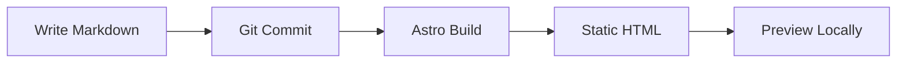

Welcome to AI Lab Notes -- a technical blog about practical AI experimentation, coding agent workflows, and the infrastructure that supports them.

## What This Blog Covers

This blog is written for developers, hobbyists, and anyone curious about running AI tools on their own hardware. You can expect posts on:

- **Local LLMs** -- Running open-weight language models with Ollama, LM Studio, and other inference engines. Model selection by GPU tier, quantization tradeoffs, and real performance numbers.
- **AI Coding Agents** -- Practical workflows with tools like Claude Code, Cursor, Aider, and OpenCode. What works, what does not, and how to combine them effectively.
- **Browser Automation** -- Giving AI agents the ability to interact with the web using MCP servers, Playwright, and Chrome DevTools Protocol.
- **Linux System Administration** -- GPU driver management, Docker setups, service configuration, and the daily maintenance of a developer workstation.
- **Security** -- Secrets management, sandboxing, and access control when you give AI agents broad system permissions.

The goal is practical over theoretical. Posts include actual commands, configuration snippets, and honest assessments of tradeoffs.

## Table of contents

## About the Stack

The blog itself is built with [Astro](https://astro.build/) using the [AstroPaper v5](https://github.com/satnaing/astro-paper) theme. Content is plain Markdown files managed in git, authored primarily with the help of AI coding agents. Here is what the blog supports for technical content:

### Code Highlighting

Astro ships with Shiki for syntax highlighting across 200+ languages. Here is a Python example:

```python
import torch

def check_gpu():
    """Check if CUDA is available and print GPU info."""
    if torch.cuda.is_available():
        gpu = torch.cuda.get_device_name(0)
        vram = torch.cuda.get_device_properties(0).total_mem / 1e9
        print(f"GPU: {gpu} ({vram:.1f} GB VRAM)")
    else:
        print("No GPU available")

check_gpu()
```

And a bash snippet:

```bash
# Check NVIDIA driver and CUDA versions
nvidia-smi --query-gpu=driver_version,name,memory.total --format=csv
nvcc --version
```

### Mermaid Diagrams

Mermaid diagrams render client-side, which is useful for architecture overviews and workflow documentation:



### KaTeX Math

Inline math works like this: $E = mc^2$.

Display math uses double dollar signs:

$$
\mathcal{L}(\theta) = -\frac{1}{N} \sum_{i=1}^{N} \left[ y_i \log(\hat{y}_i) + (1 - y_i) \log(1 - \hat{y}_i) \right]
$$

That is the binary cross-entropy loss function, commonly used for training classification models.

## What is Next

Upcoming posts will cover running local LLMs on Linux, AI coding agent workflows, browser automation for AI agents, and securing your agent setup. Stay tuned.
