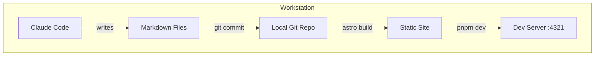

This is the inaugural post for AI Lab Notes -- a place to document AI experimentation, coding projects, and system administration on a Pop!_OS workstation with an RTX 3090.

The blog is built with [Astro](https://astro.build/) using the [AstroPaper v5](https://github.com/satnaing/astro-paper) theme. Content is authored as Markdown files, with Claude Code as the primary writing tool.

## Table of contents

## Code Highlighting

Astro ships with Shiki for syntax highlighting. Here is a Python example:

```python
import torch

def check_gpu():
    """Check if CUDA is available and print GPU info."""
    if torch.cuda.is_available():
        gpu = torch.cuda.get_device_name(0)
        vram = torch.cuda.get_device_properties(0).total_mem / 1e9
        print(f"GPU: {gpu} ({vram:.1f} GB VRAM)")
    else:
        print("No GPU available")

check_gpu()
```

And a bash snippet:

```bash
# Check NVIDIA driver and CUDA versions
nvidia-smi --query-gpu=driver_version,name,memory.total --format=csv
nvcc --version
```

## Mermaid Diagrams

The blog supports Mermaid diagrams rendered client-side. Here is the content workflow:


And a more detailed architecture diagram:



## KaTeX Math

Inline math works like this: $E = mc^2$.

Display math uses double dollar signs:

$$
\mathcal{L}(\theta) = -\frac{1}{N} \sum_{i=1}^{N} \left[ y_i \log(\hat{y}_i) + (1 - y_i) \log(1 - \hat{y}_i) \right]
$$

That is the binary cross-entropy loss function, commonly used for training classification models.

Here is the softmax function:

$$
\text{softmax}(z_i) = \frac{e^{z_i}}{\sum_{j=1}^{K} e^{z_j}}
$$

## What is Next

- Convert existing research docs into blog posts
- Set up a custom domain when ready to go public
- Add series navigation for multi-part write-ups
- Test RSS feed with a feed reader
