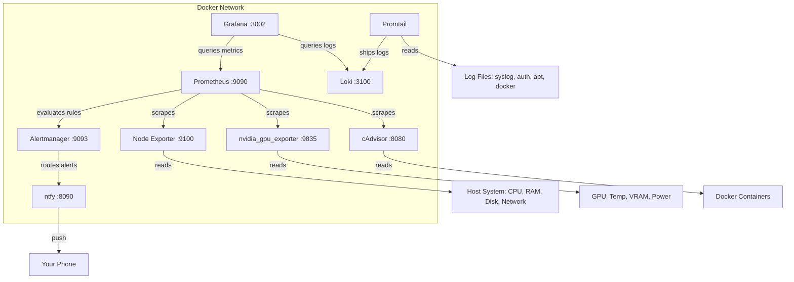

Cloud monitoring services are convenient, but they come with tradeoffs: your metrics leave your network, you depend on someone else's uptime, and pricing scales with usage. If you run a home server, a developer workstation, or a small homelab, self-hosted monitoring gives you full control with no recurring cost.

This guide walks through deploying a production-quality monitoring stack using only open-source tools from trusted foundations. Everything runs in Docker, stores data locally, and sends alerts to your phone.

## Table of contents

## Why Self-Host Monitoring?

Three reasons stand out:

1. **Privacy.** Your CPU usage, disk space, GPU temperature, running containers, and log contents never leave your machine. No data is sent to any cloud service.
2. **No vendor lock-in.** Every tool in this stack is backed by the CNCF or Grafana Labs with open-source licenses. You own your data and your dashboards.
3. **Full control.** You decide what to monitor, how long to retain data, what triggers alerts, and where those alerts go. No artificial limits on dashboards, metrics, or notification channels.

## The Stack

Here is what each component does and how they fit together:

| Component | Role | License | Origin |
|-----------|------|---------|--------|
| **Prometheus** | Metrics collection and storage | Apache 2.0 | CNCF Graduated |
| **Node Exporter** | Host metrics (CPU, RAM, disk, network) | Apache 2.0 | CNCF |
| **nvidia_gpu_exporter** | GPU temperature, VRAM, utilization | Apache 2.0 | Independent |
| **cAdvisor** | Per-container resource metrics | Apache 2.0 | Google |
| **Grafana** | Dashboard visualization | AGPLv3 | Grafana Labs |
| **Alertmanager** | Alert routing and grouping | Apache 2.0 | CNCF |
| **ntfy** | Push notifications to phone/desktop | Apache 2.0/GPL | Independent |
| **Loki** | Log aggregation | AGPLv3 | Grafana Labs |
| **Promtail** | Log shipping agent | AGPLv3 | Grafana Labs |

Every tool here is fully open source with no proprietary UI components, no cloud sign-in requirements, and no telemetry. That last point matters more than you might expect.

## Architecture Overview



**Data flow in plain English:**

1. **Prometheus** scrapes metrics every 15 seconds from Node Exporter (system stats), nvidia_gpu_exporter (GPU stats), and cAdvisor (container stats).
2. **Alertmanager** evaluates rules defined in Prometheus and routes triggered alerts to ntfy.
3. **ntfy** delivers push notifications to your phone or desktop browser.
4. **Promtail** tails log files on the host and ships them to Loki.
5. **Grafana** queries both Prometheus (metrics) and Loki (logs) to render dashboards.

## Why Not Netdata?

Netdata is a common recommendation for single-server monitoring, and its agent is genuinely excellent at collecting metrics. However, several issues make it unsuitable for a privacy-conscious, fully open-source setup:

**Licensing split.** The Netdata agent is GPLv3 (open source), but the V3 dashboard ships under the NCUL1 proprietary license. The source code for the dashboard is not available -- it ships minified only. NixOS removed it from their packages over this issue, and Ubuntu questioned its inclusion in the Universe repository.

**Cloud push.** The V2.0+ dashboard defaults to requiring Netdata Cloud SSO sign-in. A local-only mode exists but is described as "limited" in their documentation. The free tier is capped at 5 nodes and 1 custom dashboard.

**Telemetry concerns.** The agent phones home by default via PostHog analytics and a Google Cloud Function on daemon start, stop, and crash. A confirmed bug in September 2025 showed that real hostnames leaked to Netdata's servers even when telemetry was explicitly disabled.

If you are comfortable firewalling off the agent and accepting the proprietary dashboard, Netdata still provides excellent per-second metrics. But for a zero-telemetry, fully open-source stack, Prometheus plus Grafana is the better foundation.

## Docker Compose Setup

Create a `monitoring/` directory and add the following `docker-compose.yml`. This deploys the full metrics pipeline in one command.

```yaml
# monitoring/docker-compose.yml
services:
  # Prometheus - Metrics Collection (CNCF Graduated, Apache 2.0)
  prometheus:
    image: prom/prometheus:latest
    container_name: prometheus
    ports:
      - "9090:9090"
    volumes:
      - prometheus-data:/prometheus
      - ./prometheus.yml:/etc/prometheus/prometheus.yml
      - ./alert-rules.yml:/etc/prometheus/alert-rules.yml
    command:
      - '--config.file=/etc/prometheus/prometheus.yml'
      - '--storage.tsdb.retention.time=30d'
      - '--web.enable-lifecycle'
    restart: unless-stopped

  # Node Exporter - Host Metrics (CNCF, Apache 2.0)
  node-exporter:
    image: prom/node-exporter:latest
    container_name: node-exporter
    ports:
      - "9100:9100"
    volumes:
      - /proc:/host/proc:ro
      - /sys:/host/sys:ro
      - /:/rootfs:ro
    command:
      - '--path.procfs=/host/proc'
      - '--path.sysfs=/host/sys'
      - '--path.rootfs=/rootfs'
      - '--collector.filesystem.mount-points-exclude=^/(sys|proc|dev|host|etc)($$|/)'
      - '--collector.systemd'
    pid: host
    restart: unless-stopped

  # NVIDIA GPU Exporter (Apache 2.0)
  nvidia-gpu-exporter:
    image: utkuozdemir/nvidia_gpu_exporter:1.3.0
    container_name: nvidia-gpu-exporter
    ports:
      - "9835:9835"
    volumes:
      - /usr/lib/x86_64-linux-gnu/libnvidia-ml.so.1:/usr/lib/x86_64-linux-gnu/libnvidia-ml.so.1:ro
      - /usr/bin/nvidia-smi:/usr/bin/nvidia-smi:ro
    deploy:
      resources:
        reservations:
          devices:
            - driver: nvidia
              count: all
              capabilities: [gpu, utility]
    restart: unless-stopped

  # cAdvisor - Container Metrics (Google, Apache 2.0)
  cadvisor:
    image: gcr.io/cadvisor/cadvisor:latest
    container_name: cadvisor
    ports:
      - "8081:8080"
    volumes:
      - /:/rootfs:ro
      - /var/run:/var/run:ro
      - /sys:/sys:ro
      - /var/lib/docker/:/var/lib/docker:ro
      - /dev/disk/:/dev/disk:ro
    privileged: true
    devices:
      - /dev/kmsg
    restart: unless-stopped

  # Alertmanager - Alert Routing (CNCF, Apache 2.0)
  alertmanager:
    image: prom/alertmanager:latest
    container_name: alertmanager
    ports:
      - "9093:9093"
    volumes:
      - alertmanager-data:/alertmanager
      - ./alertmanager.yml:/etc/alertmanager/alertmanager.yml
    command:
      - '--config.file=/etc/alertmanager/alertmanager.yml'
    restart: unless-stopped

  # Grafana - Dashboards (AGPLv3)
  grafana:
    image: grafana/grafana:latest
    container_name: grafana-monitoring
    ports:
      - "3002:3000"
    volumes:
      - grafana-data:/var/lib/grafana
    environment:
      - GF_SECURITY_ADMIN_USER=admin
      - GF_SECURITY_ADMIN_PASSWORD=changeme
      - GF_USERS_ALLOW_SIGN_UP=false
      - GF_ANALYTICS_REPORTING_ENABLED=false
      - GF_ANALYTICS_CHECK_FOR_UPDATES=false
    restart: unless-stopped

  # ntfy - Push Notifications (Apache 2.0/GPL)
  ntfy:
    image: binwiederhier/ntfy:latest
    container_name: ntfy
    ports:
      - "8090:80"
    volumes:
      - ntfy-cache:/var/cache/ntfy
      - ntfy-etc:/etc/ntfy
    command: serve
    restart: unless-stopped

  # Loki - Log Aggregation (AGPLv3)
  loki:
    image: grafana/loki:3.4.1
    container_name: loki
    ports:
      - "3100:3100"
    volumes:
      - loki-data:/loki
      - ./loki-config.yml:/etc/loki/local-config.yaml
    command: -config.file=/etc/loki/local-config.yaml
    restart: unless-stopped

  # Promtail - Log Collector (AGPLv3)
  promtail:
    image: grafana/promtail:3.4.1
    container_name: promtail
    volumes:
      - /var/log:/var/log:ro
      - /var/lib/docker/containers:/var/lib/docker/containers:ro
      - ./promtail-config.yml:/etc/promtail/config.yml
    command: -config.file=/etc/promtail/config.yml
    restart: unless-stopped
    depends_on:
      - loki

volumes:
  prometheus-data:
  alertmanager-data:
  grafana-data:
  ntfy-cache:
  ntfy-etc:
  loki-data:
```

**Port assignments** (chosen to avoid common conflicts):

| Service | Port | Notes |
|---------|------|-------|
| Prometheus | 9090 | Default |
| Node Exporter | 9100 | Default |
| nvidia_gpu_exporter | 9835 | Default |
| cAdvisor | 8081 | Remapped from 8080 to avoid conflicts |
| Alertmanager | 9093 | Default |
| Grafana | 3002 | Remapped from 3000 to avoid dev server conflicts |
| ntfy | 8090 | Remapped from 80 |
| Loki | 3100 | Default |

If you do not have an NVIDIA GPU, remove the `nvidia-gpu-exporter` service and its corresponding Prometheus scrape target.

## Prometheus Configuration

Tell Prometheus what to scrape and where to find the alert rules:

```yaml
# monitoring/prometheus.yml
global:
  scrape_interval: 15s
  evaluation_interval: 15s

rule_files:
  - "alert-rules.yml"

alerting:
  alertmanagers:
    - static_configs:
        - targets: ["alertmanager:9093"]

scrape_configs:
  - job_name: "prometheus"
    static_configs:
      - targets: ["localhost:9090"]

  - job_name: "node"
    static_configs:
      - targets: ["node-exporter:9100"]

  - job_name: "nvidia-gpu"
    static_configs:
      - targets: ["nvidia-gpu-exporter:9835"]

  - job_name: "cadvisor"
    static_configs:
      - targets: ["cadvisor:8080"]
```

The `scrape_interval` of 15 seconds is a good balance between resolution and resource usage. For a single machine, this generates roughly 50-100 MB of storage per day depending on how many containers you run.

## Key Exporters Explained

### Node Exporter: System Metrics

Node Exporter exposes hundreds of host-level metrics. The most useful ones:

- `node_cpu_seconds_total` -- CPU usage per core and mode (user, system, idle, iowait)
- `node_memory_MemAvailable_bytes` -- actual available memory (not just "free")
- `node_filesystem_avail_bytes` -- free disk space per mount point
- `node_network_receive_bytes_total` -- network throughput per interface
- `node_systemd_unit_state` -- whether systemd services are running

The `--collector.systemd` flag (included in the Docker Compose above) enables monitoring of systemd service states, which is essential for alerting on service failures.

### nvidia_gpu_exporter: GPU Metrics

If you run GPU workloads (ML training, inference, image generation), GPU monitoring is essential. This exporter reads from `nvidia-smi` and exposes:

- `nvidia_gpu_temperature_celsius` -- thermal monitoring to prevent throttling
- `nvidia_gpu_memory_used_bytes` / `nvidia_gpu_memory_total_bytes` -- VRAM utilization
- `nvidia_gpu_utilization_gpu` -- GPU compute utilization percentage
- `nvidia_gpu_power_draw_watts` -- power consumption

For systems with an RTX 3090 or similar high-power GPU, watching temperature is critical. These cards thermal throttle at 83C by default and have a hard limit at 92C.

### cAdvisor: Container Metrics

cAdvisor (from Google) automatically discovers all Docker containers and provides per-container:

- CPU usage and throttling
- Memory usage and limits
- Network I/O per container
- Disk I/O per container

This is invaluable for catching runaway containers. If an LLM inference container starts consuming all available RAM, you will see it in the cAdvisor metrics before the system starts swapping.

## Alert Rules

Alert rules live in a YAML file that Prometheus evaluates at the `evaluation_interval`:

```yaml
# monitoring/alert-rules.yml
groups:
  - name: host
    rules:
      - alert: HighCPUUsage
        expr: >
          100 - (avg by(instance)
            (rate(node_cpu_seconds_total{mode="idle"}[5m])) * 100) > 90
        for: 5m
        labels:
          severity: warning
        annotations:
          summary: "CPU usage above 90% for 5 minutes"

      - alert: HighMemoryUsage
        expr: >
          (1 - node_memory_MemAvailable_bytes
            / node_memory_MemTotal_bytes) * 100 > 90
        for: 5m
        labels:
          severity: warning
        annotations:
          summary: "Memory usage above 90% for 5 minutes"

      - alert: DiskSpaceLow
        expr: >
          (1 - node_filesystem_avail_bytes{mountpoint="/"}
            / node_filesystem_size_bytes{mountpoint="/"}) * 100 > 80
        for: 5m
        labels:
          severity: warning
        annotations:
          summary: "Disk usage above 80%"

      - alert: DiskSpaceCritical
        expr: >
          (1 - node_filesystem_avail_bytes{mountpoint="/"}
            / node_filesystem_size_bytes{mountpoint="/"}) * 100 > 95
        for: 1m
        labels:
          severity: critical
        annotations:
          summary: "Disk usage above 95% -- critical"

  - name: gpu
    rules:
      - alert: GPUHighTemperature
        expr: nvidia_gpu_temperature_celsius > 85
        for: 2m
        labels:
          severity: warning
        annotations:
          summary: "GPU temperature above 85C"

      - alert: GPUCriticalTemperature
        expr: nvidia_gpu_temperature_celsius > 92
        for: 1m
        labels:
          severity: critical
        annotations:
          summary: "GPU temperature above 92C -- thermal throttling imminent"

      - alert: GPUVRAMHigh
        expr: >
          nvidia_gpu_memory_used_bytes
            / nvidia_gpu_memory_total_bytes * 100 > 95
        for: 5m
        labels:
          severity: warning
        annotations:
          summary: "GPU VRAM usage above 95%"

  - name: services
    rules:
      - alert: ContainerRestarting
        expr: rate(container_last_seen[5m]) > 2
        for: 5m
        labels:
          severity: warning
        annotations:
          summary: "Container restarting frequently"
```

**Tuning tip:** Start with conservative thresholds and tighten them after a week of observing your baseline. A desktop workstation that regularly uses 70% RAM during ML inference should not alert at 80% -- adjust accordingly.

## Alertmanager and ntfy: Getting Notifications

### Alertmanager Configuration

Alertmanager groups related alerts, deduplicates them, and routes them to notification receivers:

```yaml
# monitoring/alertmanager.yml
global:
  resolve_timeout: 5m

route:
  receiver: "ntfy"
  group_by: ["alertname"]
  group_wait: 30s
  group_interval: 5m
  repeat_interval: 4h
  routes:
    - match:
        severity: critical
      receiver: "ntfy-critical"
      repeat_interval: 1h

receivers:
  - name: "ntfy"
    webhook_configs:
      - url: "http://ntfy:80/workstation-alerts"
        send_resolved: true

  - name: "ntfy-critical"
    webhook_configs:
      - url: "http://ntfy:80/workstation-critical"
        send_resolved: true
```

### ntfy: Push Notifications

ntfy is a dead-simple notification service. After deploying it with the Docker Compose above, install the ntfy app on your phone and subscribe to your topics (`workstation-alerts` and `workstation-critical`).

You can also send ad-hoc alerts from any script:

```bash
# Simple alert
curl -d "Disk usage above 80%" http://localhost:8090/workstation-alerts

# Alert with priority and tags
curl \
  -H "Title: High GPU Temperature" \
  -H "Priority: high" \
  -H "Tags: warning,thermometer" \
  -d "GPU at 87C for more than 2 minutes" \
  http://localhost:8090/workstation-alerts
```

This makes ntfy useful beyond just Prometheus alerts. You can send notifications from cron jobs, backup scripts, or any automation.

## Loki and Promtail: Centralized Logs

### Why Loki Over the ELK Stack

Elasticsearch + Logstash + Kibana (ELK) is the traditional log aggregation stack, but it is massively overbuilt for a single machine. Elasticsearch alone can consume several gigabytes of RAM.

Loki takes a different approach: it indexes only log labels (like job name, hostname, log level), not the full text of every log line. This makes it roughly 10x lighter than Elasticsearch while still providing fast log search through Grafana.

### Loki Configuration

```yaml
# monitoring/loki-config.yml
auth_enabled: false

server:
  http_listen_port: 3100

common:
  path_prefix: /loki
  storage:
    filesystem:
      chunks_directory: /loki/chunks
      rules_directory: /loki/rules
  replication_factor: 1
  ring:
    kvstore:
      store: inmemory

schema_config:
  configs:
    - from: 2020-10-24
      store: tsdb
      object_store: filesystem
      schema: v13
      index:
        prefix: index_
        period: 24h

limits_config:
  retention_period: 30d

compactor:
  working_directory: /loki/compactor
  retention_enabled: true
```

**Key settings:**

- `retention_period: 30d` -- logs older than 30 days are automatically deleted. Adjust based on your disk space.
- `auth_enabled: false` -- no authentication needed for a single-user setup. Enable this if the service is exposed to the network.
- `replication_factor: 1` -- single node, no replication needed.

### Promtail Configuration

Promtail is the agent that tails log files and ships them to Loki:

```yaml
# monitoring/promtail-config.yml
server:
  http_listen_port: 9080
  grpc_listen_port: 0

positions:
  filename: /tmp/positions.yaml

clients:
  - url: http://loki:3100/loki/api/v1/push

scrape_configs:
  - job_name: syslog
    static_configs:
      - targets: [localhost]
        labels:
          job: syslog
          __path__: /var/log/syslog

  - job_name: auth
    static_configs:
      - targets: [localhost]
        labels:
          job: auth
          __path__: /var/log/auth.log

  - job_name: apt
    static_configs:
      - targets: [localhost]
        labels:
          job: apt
          __path__: /var/log/apt/history.log

  - job_name: dpkg
    static_configs:
      - targets: [localhost]
        labels:
          job: dpkg
          __path__: /var/log/dpkg.log

  - job_name: docker
    static_configs:
      - targets: [localhost]
        labels:
          job: docker
          __path__: /var/lib/docker/containers/*/*-json.log
    pipeline_stages:
      - json:
          expressions:
            log: log
            stream: stream
            time: time
      - output:
          source: log
```

The `auth` job is particularly useful -- it captures `sudo` commands, SSH login attempts, and authentication events. If you use AI coding agents that run commands with `sudo`, every invocation will show up here.

**Rate limiting tip:** If you have noisy containers that generate high log volumes, add a `rate` stage to Promtail:

```yaml
pipeline_stages:
  - rate:
      rate: 100  # max 100 log lines per second
```

This prevents a misbehaving container from overwhelming Loki with logs.

## Grafana Dashboard Provisioning

Instead of manually creating dashboards through the Grafana UI, you can provision them from JSON files that load automatically on startup. This makes your dashboards reproducible and version-controlled.

### Importing Community Dashboards

The fastest way to get started is importing pre-built dashboards by ID:

1. Open Grafana at `http://localhost:3002`
2. Go to **Dashboards** > **Import**
3. Enter a dashboard ID and click **Load**

Recommended dashboard IDs:

| ID | Dashboard | Shows |
|----|-----------|-------|
| 1860 | Node Exporter Full | CPU, RAM, disk, network, filesystem, systemd |
| 15117 | NVIDIA GPU Exporter | GPU temperature, VRAM, utilization, power draw |
| 14282 | cAdvisor Docker | Per-container CPU, memory, network, disk I/O |

### Provisioning as Code

For a git-tracked setup, create a provisioning directory that Grafana reads on startup.

Add a volume mount to the Grafana service in your Docker Compose:

```yaml
grafana:
  volumes:
    - grafana-data:/var/lib/grafana
    - ./grafana/provisioning:/etc/grafana/provisioning
```

Create the provisioning structure:

```
monitoring/grafana/provisioning/
  datasources/
    datasources.yml
  dashboards/
    dashboards.yml
    json/
      node-exporter.json
      gpu.json
      docker.json
```

Auto-configure the Prometheus and Loki data sources:

```yaml
# monitoring/grafana/provisioning/datasources/datasources.yml
apiVersion: 1
datasources:
  - name: Prometheus
    type: prometheus
    access: proxy
    url: http://prometheus:9090
    isDefault: true

  - name: Loki
    type: loki
    access: proxy
    url: http://loki:3100
```

And tell Grafana where to find dashboard JSON files:

```yaml
# monitoring/grafana/provisioning/dashboards/dashboards.yml
apiVersion: 1
providers:
  - name: default
    folder: ""
    type: file
    options:
      path: /etc/grafana/provisioning/dashboards/json
```

Export any dashboard you have configured in Grafana as JSON (Dashboard > Share > Export > Save to file), place the JSON file in the `json/` directory, and it will load automatically on every Grafana restart.

## Deploying the Stack

With all configuration files in place, bring up the entire stack:

```bash
cd monitoring/
docker compose up -d
```

Verify all services are healthy:

```bash
docker compose ps
```

Then confirm each service is accessible:

- **Prometheus:** http://localhost:9090/targets -- all targets should show "UP"
- **Grafana:** http://localhost:3002 -- log in with admin/changeme, then change the password
- **Alertmanager:** http://localhost:9093 -- should show the configured routes
- **ntfy:** http://localhost:8090 -- should show the ntfy web interface

Add Prometheus as a data source in Grafana (URL: `http://prometheus:9090`), then import the community dashboards listed above.

## Practical Tips

### Disable Grafana Telemetry

Grafana sends anonymous usage statistics by default. The Docker Compose above already disables this with:

```yaml
environment:
  - GF_ANALYTICS_REPORTING_ENABLED=false
  - GF_ANALYTICS_CHECK_FOR_UPDATES=false
```

### Retention and Disk Usage

With default settings:

- **Prometheus** retains 30 days of metrics. For a single host with 3 exporters, this uses roughly 1-3 GB.
- **Loki** retains 30 days of logs. Usage depends heavily on log volume -- a quiet system might use 500 MB, while a system with verbose Docker containers could use several GB.
- **Grafana** data (dashboards, preferences) is typically under 100 MB.

To check current disk usage:

```bash
docker system df -v | grep -E "prometheus|loki|grafana"
```

### Port Conflict Avoidance

The Docker Compose remaps several ports to avoid conflicts with common development tools:

- Grafana uses 3002 instead of 3000 (Next.js dev servers, Create React App)
- cAdvisor uses 8081 instead of 8080 (common web server port)
- ntfy uses 8090 instead of 80

If you still hit conflicts, check what is listening:

```bash
ss -tlnp | grep -E ':(3002|8081|9090|9100|8090) '
```

### Securing the Stack

For a machine on a home network, the default setup (services on localhost) is sufficient. If you need remote access or run on a shared network:

1. **Bind to localhost only** by changing port mappings to `"127.0.0.1:9090:9090"`.
2. **Add authentication to Grafana** -- it has built-in auth, so change the default password immediately.
3. **Put a reverse proxy** (Nginx, Caddy, or Traefik) in front of services that lack built-in auth (Prometheus, Alertmanager, ntfy).
4. **Use Docker networks** to isolate monitoring services from application containers.

## What You Get

After deploying this stack, you have:

- **Real-time system metrics** with 15-second resolution, retained for 30 days
- **GPU monitoring** with temperature alerts to prevent thermal damage
- **Container-level visibility** showing exactly which service is consuming resources
- **Centralized log search** across system logs, auth logs, package management, and Docker containers
- **Push notifications** on your phone when something goes wrong
- **Version-controlled dashboards** that survive container rebuilds

All of this runs locally, sends nothing to the cloud, and uses roughly 500 MB of RAM total. The entire stack can be rebuilt from the configuration files in your git repository with a single `docker compose up -d`.

## Further Reading

- [Prometheus documentation](https://prometheus.io/docs/introduction/overview/)
- [Grafana Loki documentation](https://grafana.com/docs/loki/latest/)
- [ntfy documentation](https://ntfy.sh/docs/)
- [Awesome Prometheus Alerts](https://awesome-prometheus-alerts.grep.to/) -- community-maintained collection of alert rules
- [Grafana Dashboard Directory](https://grafana.com/grafana/dashboards/) -- thousands of community dashboards searchable by data source
