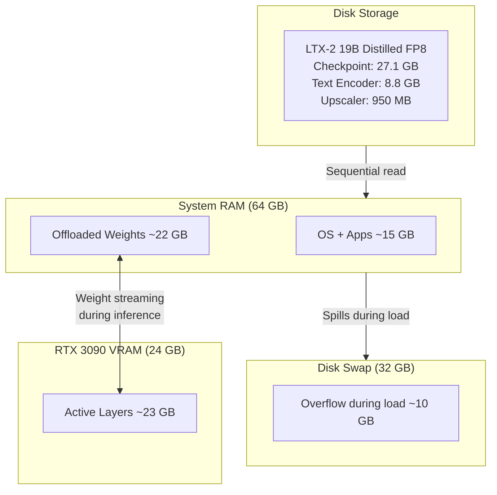
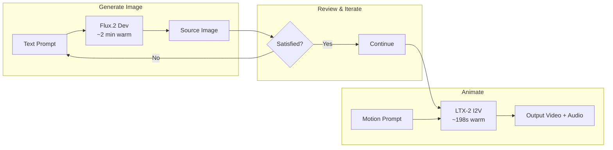

Text-to-video generation has crossed the "runnable on consumer hardware" threshold. Lightricks' LTX-2 19B Distilled model generates 5-second, 1080p videos with audio on a single RTX 3090 -- no cloud GPU rental, no API costs, no uploaded data. The catch is that it takes some work to get there, and the model has non-obvious constraints that will waste hours if you do not know about them upfront.

This guide covers everything I learned setting up LTX-2 on an RTX 3090 (24 GB VRAM, 64 GB RAM) with ComfyUI. It includes the weight streaming architecture that makes this possible, a head-to-head FP8 vs BF16 checkpoint comparison, the distilled model constraints that most online guides get wrong, and prompting lessons that make the difference between a cinematic clip and a Ken Burns slideshow.

## Table of contents

## Hardware Requirements

LTX-2 19B is a large model. The checkpoint alone is 27-40 GB depending on precision, and it needs a text encoder (Gemma 3 12B, 8.8 GB) and a spatial upscaler (950 MB) alongside it. You cannot fit this in 24 GB of VRAM.

The minimum practical setup:

| Component | Requirement | Why |
|-----------|------------|-----|
| GPU VRAM | 24 GB (RTX 3090/4090) | Model layers stream in and out during inference, peaking at ~23 GB |
| System RAM | 64 GB | Offloaded model weights live here (~22-28 GB depending on checkpoint) |
| Disk swap | 32 GB recommended | Safety net during model loading when RAM temporarily overflows |
| Storage | ~70 GB free | Checkpoint + text encoder + upscaler + output files |

With less than 64 GB RAM, you will likely OOM during model loading. With less than 24 GB VRAM, you would need to use `--novram` mode (CPU-only inference), which is too slow to be practical.

## How Weight Streaming Works

ComfyUI's weight streaming is what makes consumer GPU video generation possible. The concept is straightforward: the model is too large for VRAM, so ComfyUI loads what fits on the GPU and parks the rest in system RAM. During inference, it streams layers back and forth as needed.



This is not free -- streaming adds latency compared to having the full model in VRAM. But it transforms "impossible on this hardware" into "takes a few minutes." The practical impact is that cold starts (first generation after loading) take longer than warm runs (models already in memory).

## The Two-Pass Pipeline

LTX-2 uses a clever two-pass architecture to generate high-quality video:

1. **Pass 1:** Generate at half resolution (e.g., 640x360 for a 1280x720 target) with 8 sampling steps
2. **Latent Upscale:** 2x upscale using a dedicated spatial upscaler model in latent space
3. **Pass 2:** Refine at full resolution with 3 additional sampling steps

This is more efficient than generating at full resolution from scratch, and it produces better results because the upscaler preserves temporal coherence across frames.

The default output is 121 frames at 24 fps -- about 5 seconds of video with generated audio.

## FP8 vs BF16: The Checkpoint That Changes Everything

Lightricks provides two versions of the distilled checkpoint:

- **BF16** (`ltx-2-19b-distilled.safetensors`): 40.3 GB, full 16-bit precision
- **FP8** (`ltx-2-19b-distilled-fp8.safetensors`): 27.1 GB, 8-bit quantized

I ran both on the same hardware and the difference is dramatic:

| Metric | BF16 | FP8 | Improvement |
|--------|------|-----|-------------|
| Cold start time | ~13 min | ~3.5 min | **3.7x faster** |
| Checkpoint size | 40.3 GB | 27.1 GB | -33% |
| Peak swap usage | 33 GB | ~10 GB | **-70%** |
| Peak RAM | ~50 GB | ~45 GB | -10% |
| VRAM peak | 22.9 GB | 23.3 GB | Similar |
| Video quality | Baseline | Comparable | Minimal loss |

The cold start improvement alone is worth the switch. Going from 13 minutes to 3.5 minutes of staring at a progress bar changes the experience from "go make coffee" to "that was quick." And the swap reduction means the system stays responsive during model loading instead of thrashing the disk for several minutes.

**Quality difference?** In side-by-side comparisons at 1080p, I could not consistently tell which was FP8 and which was BF16. For video output where individual frame sharpness matters less than temporal coherence, the quantization loss is effectively invisible.

**Recommendation:** Start with FP8. Keep the BF16 checkpoint as a backup for quality-critical work, but FP8 should be your default.

## The Distilled Model Trap

This is where most online guides will lead you astray. If you search for "LTX-2 best settings ComfyUI," you will find recommendations like:

- CFG scale 3.5-4.0
- DPM++ 2M Karras sampler
- Negative prompts for quality
- 5+ refinement steps in Pass 2

**These settings are for the full (non-distilled) model. They will break the distilled variant.**

I tested each of these changes systematically. Here is what happened:

| Change | Result |
|--------|--------|
| CFG 4.0 (from 1.0) | Severe color distortion, unusable output |
| DPM++ 2M Karras sampler (from euler_ancestral) | Heavy filter-like artifacts, looked like a "1990s Photoshop filter on a music video" |
| Negative prompt added | Zero effect (mathematically cancelled at CFG 1.0) |
| Pass 2 steps increased to 5 (from 3) | Scene reinterpretation -- backwards heads, flipped body orientation |
| Pass 2 starting sigma increased to 0.975 (from 0.909) | Same scene reinterpretation artifacts |

The distilled model has guidance baked into its weights through the distillation process. When you apply external CFG on top, you are double-applying guidance -- like adjusting the brightness twice. The math explains why negative prompts do nothing: at CFG 1.0, the classifier-free guidance formula `output = uncond + CFG * (cond - uncond)` simplifies to just `cond`, completely cancelling the negative.

The safe parameter space for the distilled model:

| Parameter | Required Value | Explanation |
|-----------|---------------|-------------|
| Sampler | `euler_ancestral` | Distillation was trained for this sampler specifically |
| CFG | 1.0 | Guidance is baked into weights |
| Pass 2 starting sigma | 0.909375 max | Higher values add too much noise, causing regeneration |
| Pass 2 steps | 3 | More steps render artifacts in higher detail rather than fixing them |

**Resolution is the quality lever.** The most visible quality improvement comes from going 720p to 1080p (2.3x more pixels). The two presets worth using:

| Preset | Resolution | Warm Time | Use Case |
|--------|-----------|-----------|----------|
| Standard | 1280x720 | ~96s | Quick tests, iteration |
| High | 1920x1088 | ~198s | Final output |

Resolution must be divisible by 32 for the latent space encoder, which is why "1080p" is actually 1920x1088.

## Prompting: Video Style, Not Photography Style

This was the most frustrating lesson to learn. My first attempts used photography-style prompts:

> *"A woman in ornate fantasy plate armor, photorealistic, shot on 35mm film, natural lighting, shallow depth of field, fine film grain"*

The result? A still image with a slow Ken Burns pan across it. Every single time.

The problem is that LTX-2 interprets photography terms literally. "Shot on 35mm film" means a photograph. "Shallow depth of field" describes a still camera setup. The model obliges by generating a static image and adding subtle camera drift.

What works is **video-style prompting** -- describing events unfolding over time:

> *"A woman in ornate fantasy plate armor stands on a windswept cliff edge at golden hour. The wind catches her dark hair, sending strands across her face as her crimson cape billows behind her. She gazes out over a vast misty canyon below. The camera slowly pushes in toward her profile as distant thunder echoes through the valley. The golden light catches the intricate engravings on her steel pauldrons. A faint metallic clinking of armor accompanies the howling wind."*

The difference is night and day. The second prompt produces actual motion -- hair blowing, cape moving, camera pushing in, ambient audio.

### Prompting Rules

What works well:

- **Temporal descriptions:** Describe what happens over the 5 seconds. "The wind catches...", "The camera slowly pushes in...", "Smoke rises from..."
- **Camera movement:** Be explicit -- "camera slowly dollies in", "tracking shot from the side." Simpler movements produce better results.
- **Audio cues:** LTX-2 generates audio alongside video. "Howling wind", "metallic clinking", "distant thunder" all get rendered.
- **Textures and materials:** Specific details improve output -- "weathered steel plate armor", "scarred textured hide"
- **Subtle motion over complex action:** A person standing with wind in their hair looks far better than someone swinging a weapon

What to avoid:

- **Photography terms:** "Shot on 35mm film", "shallow depth of field", "bokeh" -- these produce stills
- **"Static shot" or "no camera movement":** Produces a Ken Burns pan on a frozen frame
- **Complex multi-character action:** Multiple people fighting or running causes severe warping artifacts
- **High subject deformation:** Complex body motion (rearing back, swinging weapons, running) causes warping that no amount of quality settings can fix

The general principle: **the less things move on screen, the better they look.** A static subject with atmospheric motion (wind, smoke, light changes) and a slow camera move will always beat a complex action scene at this model size.

## Image-to-Video Pipeline

LTX-2 supports animating still images, which opens up a powerful two-step workflow:

1. Generate a high-quality still with Flux.2 Dev (or any image model)
2. Animate it with LTX-2 image-to-video

This gives you composition control that text-to-video cannot match -- you can iterate on the image until it is exactly right, then add motion.

The key difference in prompting: for image-to-video, the prompt should describe **what happens next**, not the scene. The image already defines the visual content. Focus on camera movement, subject motion, and ambient sounds.



In practice, text-to-video sometimes outperforms image-to-video because it has more freedom to create motion-optimized first frames. Test both approaches for important outputs.

## API-Driven Generation with ComfyUI

ComfyUI exposes a REST API that lets you queue workflows without the browser UI. This is essential for batch generation and integration with other tools.

The workflow:

1. Export a workflow template from ComfyUI's browser interface (`app.graphToPrompt()`)
2. Modify parameters in the JSON (prompt text, resolution, seeds, filenames)
3. POST to `/api/prompt` to queue
4. Poll `/api/queue` to monitor progress

```python
import json, random, urllib.request

with open("ltx2-text-to-video.json") as f:
    workflow = json.load(f)

# Set your prompt
workflow["177:109"]["inputs"]["value"] = "Your video prompt here..."

# Set resolution (1920x1088 for high quality)
workflow["177:131"]["inputs"]["width"] = 1920
workflow["177:131"]["inputs"]["height"] = 1088

# Randomize seeds for variety
workflow["177:123"]["inputs"]["noise_seed"] = random.randint(1, 2**32)
workflow["177:118"]["inputs"]["noise_seed"] = random.randint(1, 2**32)

# Queue it
payload = json.dumps({"prompt": workflow}).encode()
req = urllib.request.Request("http://localhost:8188/api/prompt",
    data=payload, headers={"Content-Type": "application/json"})
resp = json.loads(urllib.request.urlopen(req).read())
print(f"Queued: {resp['prompt_id']}")
```

### Batch Generation

ComfyUI processes a queue FIFO and keeps models loaded between jobs that use the same models. Queue all your videos at once:

```
Optimal:  [Video1, Video2, Video3, Video4]
                    ↑ models load once

Wasteful: [Image1, Video1, Image2, Video2]
               ↑ load  ↑ swap  ↑ swap  ↑ swap
```

Group same-model jobs together. If you are generating both images (Flux.2) and videos (LTX-2), do all images first, then all videos. Each model swap costs 3-13 minutes depending on the checkpoint.

## Performance Summary

With FP8 checkpoint on RTX 3090 (24 GB VRAM, 64 GB RAM):

| Scenario | Time | Notes |
|----------|------|-------|
| Cold start (720p) | ~3.5 min | Models loading from disk |
| Warm standard (720p) | ~96s | Models already in memory |
| Warm high (1080p) | ~198s | Best quality, 2.3x more pixels |
| Batch (warm, per video) | ~180s avg | Between-job overhead ~30s |

GPU temperature peaks at 79°C during Pass 2 refinement. The RTX 3090 stays well within thermal limits even during extended batch runs.

## What I Would Do Differently

If I were starting from scratch:

1. **Skip BF16, go straight to FP8.** The quality difference is imperceptible and you avoid swap headaches entirely.
2. **Read the built-in template prompts before writing your own.** ComfyUI's example prompts for LTX-2 use temporal descriptions with camera movements and audio cues. They are a better tutorial than any guide.
3. **Start at 720p for prompt iteration.** It takes half the time and the motion quality is the same -- only sharpness differs. Switch to 1080p once you have a prompt you like.
4. **Do not trust community "best settings" posts.** Most target the full (non-distilled) model. If someone recommends CFG > 1.0 or a sampler other than euler_ancestral for the distilled checkpoint, their advice will produce artifacts.
5. **Keep scenes simple.** The model's quality ceiling is high for calm scenes with subtle motion. Push it toward complex action and quality falls off a cliff regardless of settings.

## Setup Checklist

For anyone setting up LTX-2 on similar hardware:

- [ ] Install ComfyUI with PyTorch 2.6+ and CUDA 12.4+
- [ ] Install ComfyUI-LTXVideo custom node from Lightricks
- [ ] Download `ltx-2-19b-distilled-fp8.safetensors` (27.1 GB) to `models/checkpoints/`
- [ ] Download Gemma 3 12B text encoder (8.8 GB) to `models/text_encoders/`
- [ ] Download spatial upscaler (950 MB) to `models/latent_upscale_models/`
- [ ] Create 32 GB swap file as safety net (`fallocate -l 32G /swapfile-ai && mkswap /swapfile-ai && swapon /swapfile-ai`)
- [ ] Use the built-in "LTX-2 Text to Video (Distilled)" template
- [ ] Do not change CFG, sampler, or sigma schedule from defaults
- [ ] Write video-style prompts with temporal descriptions and audio cues
